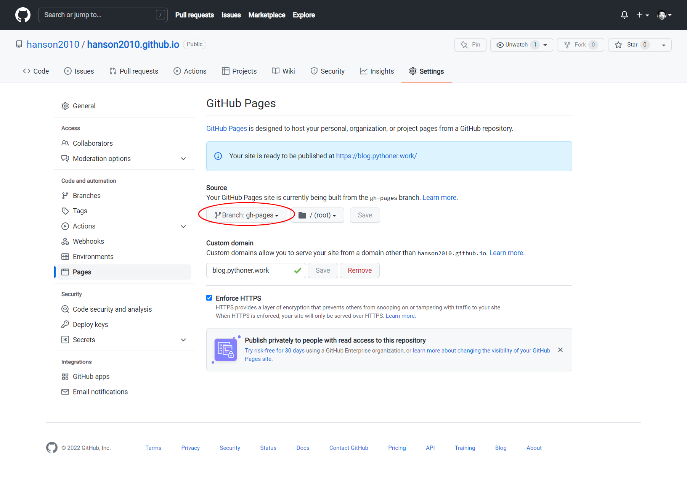

# 安装软件
## 安装Git for Windows
```shell
C:\>git --version
git version 2.35.2.windows.1
```
<!-- more -->
## 安装Hugo
把下载的hugo_extended_0.97.0_Windows-64bit.zip解压到`C:\bin\hugo_extended_0.97.0_Windows-64bit`。

把该目录添加到Path。
```shell
C:\>hugo version
hugo v0.97.0-c07f3626e7c8160943591f4d209977efa02c3dca+extended windows/amd64 BuildDate=2022-04-14T08:45:07Z VendorInfo=gohugoio
```

# 在本地搭建
## 新建项目
```shell
C:\>cd _gh
C:\_gh>hugo new site hanson2010.github.io
```

由于Hugo跟Hexo不同，没有内置模板，下载一份喜欢的模板（我用[kiera](https://themes.gohugo.io/themes/hugo-kiera/)）。
```shell
C:\_gh>cd hanson2010.github.io
C:\_gh\hanson2010.github.io>git init
C:\_gh\hanson2010.github.io>git submodule add https://github.com/funkydan2/hugo-kiera.git themes/kiera
C:\_gh\hanson2010.github.io>echo theme = "kiera" > config.toml
```

## 试发一篇文章
```shell
C:\_gh\hanson2010.github.io>hugo new posts/my-first-post.md
```

这时已生成一个文件`content/posts/my-first-post.md`，而且内容被初始化为：
```yaml
title: "My First Post"
date: 2022-04-14T20:07:04+08:00
draft: true
```

## 本地运行
```shell
C:\_gh\hanson2010.github.io>hugo server -D
```

访问`http://localhost:1313`看看效果吧：


## 修改一些风格
编辑`config.toml`。可以参考你选择的主题提供的范例，我使用的kiera的范例在[这里](https://github.com/funkydan2/hugo-kiera/blob/master/exampleSite/config.toml)。

其中可以设置等一下要发布到的域名：
```toml
baseURL = "https://blog.pythoner.work/"
```

## 编辑文章
编辑文件`content/posts/my-first-post.md`：
```yaml
---
title: "中文标题"
date: 2022-04-14T20:07:04+08:00
categories:
- Tutorial
tags:
- hugo
- blog
- github
---
```

## 本地构建
注意，如果你和我一样将在下一步把blog发布到GitHub，则可以利用Github Action这个工具实现CI（在push时自动构建），而并不需要本地构建。

如果你使用自有VPS，可以使用以下命令在本地构建一个`public`文件夹：
```shell
C:\_gh\hanson2010.github.io>hugo -D
```

# 发布到GitHub
## 新建git仓库
以下我使用图形化工具GitHub Desktop。

使用Add existing repository功能导入项目`hanson2010.github.io`。

新建配置文件`.gitignore`：
```plaintext
# Generated files by hugo
/public/
/resources/_gen/
/assets/jsconfig.json
hugo_stats.json

# Executable may be added to repository
hugo.exe
hugo.darwin
hugo.linux

# Temporary lock file while building
/.hugo_build.lock
```

为了让项目更完整，建议新建`README.md`：
```markdown
# hanson.blog();

This is the source files of [my weblog](https://blog.pythoner.work), hosted and built at GitHub Pages.
```

为了使用GitHub Action，需要新建`.github/workflows/gh-pages.yml`。

内容为：
```yaml
name: github pages

on:
push:
branches:
- main# Set a branch to deploy
pull_request:

jobs:
deploy:
runs-on: ubuntu-20.04
steps:
- uses: actions/checkout@v2
with:
submodules: true# Fetch Hugo themes (true OR recursive)
fetch-depth: 0# Fetch all history for .GitInfo and .Lastmod

- name: Setup Hugo
uses: peaceiris/actions-hugo@v2
with:
hugo-version: 'latest'
# extended: true

- name: Build
run: hugo --minify

- name: Deploy
uses: peaceiris/actions-gh-pages@v3
if: github.ref == 'refs/heads/main'
with:
github_token: ${{ secrets.GITHUB_TOKEN }}
publish_dir: ./public
```

## 上传
此时已经全部准备好，commit和publish。

为了使用GitHub Pages，需要发布为public。

## 在GitHub页面上的配置工作
在push完成后，项目已自动构建了一个新的Branch，叫做`gh-pages`。

到GitHub网页，打开Settings -> Pages，把Source从`None`改为`gh-pages`：


