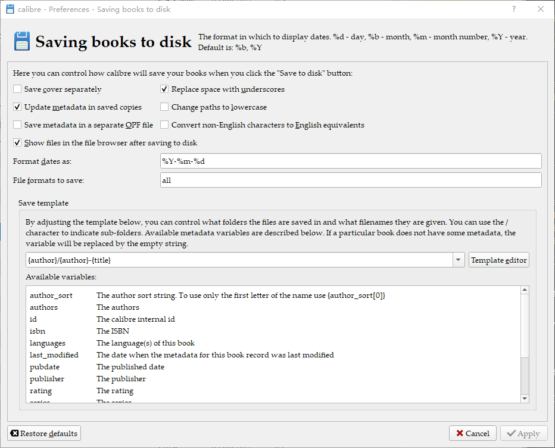

近日亚马逊[宣布](https://www.amazon.cn/b/node=2339201071)Kindle业务将在2年后撤离中国。

2014年在香港工作时，从美亚入坑**Kindle PaperWhite 2 (2013) WiFi (U.S., Intl.)**，8年间前后购入80几本书。决定先保全这些书，再换绑美亚。

# 工具
- [calibre 5.43.0](https://calibre-ebook.com)
- [DeDRM tools 10.0.2](https://github.com/noDRM/DeDRM_tools)

# 步骤

## 下载电子书

在电子书清单界面，点击`...`按钮，选择`通过电脑下载USB传输`。

80几本对我来说手工操作就好，犯懒的同学可以找油猴脚本来跑。

再到设备详情界面，拷贝下序列号，后面用。

## 准备工具

解压DeDRM_tools_10.0.2.zip。

运行calibre，打开Preferences界面。

修改Saving books to disk设置，取消勾选`Save cover separately`和`Save metadata in a separate OPF file`，勾选`Replace space with underscores`，把Save template修改为`{author}/{author}-{title}`。

打开Plugins对话框，点击`Load plugin from file`按钮，选择DeDRM_plugin.zip文件。导入成功后，在File type中找到DeDRM并双击。点击`eInk Kindle ebooks`按钮，输入设备序列号。

## 加工

回到主界面，通过Add books功能导入下载的书籍。导入过程中后台已自动执行DeDRM动作。注意，也只有在导入的过程中才能执行这个动作。

通过Edit metadata功能清理一下Title和Author(s)信息。

再通过Save to disk功能导出azw3文件。按照设计的template，相同作者的作品将保存在同一个文件夹内。注意，如果书是旧版的mobi格式，可能需要先通过Convert books功能生成azw3文件。

## 拷贝

把Kindle连接到电脑，拷贝azw3文件到`documents`文件夹。放在子文件夹中亦可。

顺便，把中意的中文字体[**霞鹜文楷**](https://github.com/lxgw/LxgwWenKai)拷贝到`fonts`文件夹。注意，旧的mobi格式书籍可能不支持自定义字体。

# 换绑

## 还原

设置 -> 设备选项 -> 重置。

## 登录

使用美亚账号登录。

确认设备对应电邮地址，可以发Digital Content到这个地址。注意，附件并不支持azw3格式，反而支持epub格式<i class="far fa-grin-tears"></i> 虽然暂时不能显示书籍封面，但无大碍。
