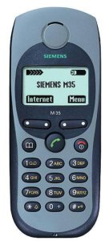
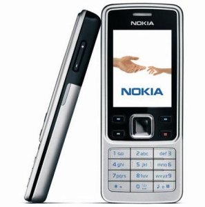
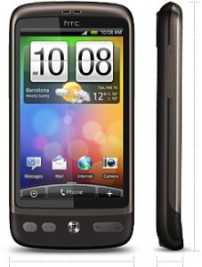

之所以这么说，是因为第1只手机Siemens 3518i用了大概一个月（记不太清了），连着学生证、书包一起丢在了出租车上没有找回来，于是回到位于西单的同一家店又买了同一款。这款三防手机（防水、防尘、防摔）果然禁造，01-07年服役6年。
<!-- more -->
第2款手机是在迪信通买的彩屏钢壳的NOKIA 6300，堪称街机。07-10年效力3年。

本周一入手了平生第3款第4只手机HTC Desire，鸟枪换炮进入智能手机时代，也是俺第1次试水水货。按照趋势分析它怕只有1-2年的工龄。

