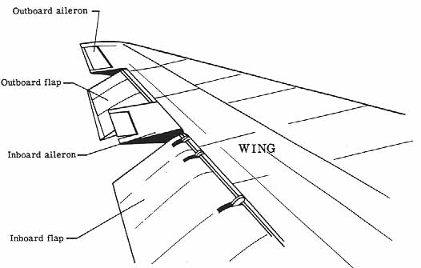
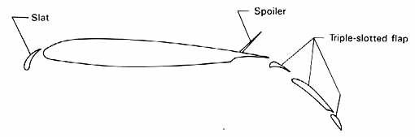

机头 Nose
机翼 Wing
襟翼 Flap
襟翼整流罩 Flap fairing
副翼 Aileron
缝翼 Slat
扰流板 Spoiler
小翼 Winglet
水平尾翼 Horizontal stabiliser
升降舵 Elevator
垂直尾翼 Vertical stabilizer
方向舵 Rudder
前轮 Nose wheel
主起落架 Main landing gear

（来自[NASA网站](http://www.nasa.gov/)）
