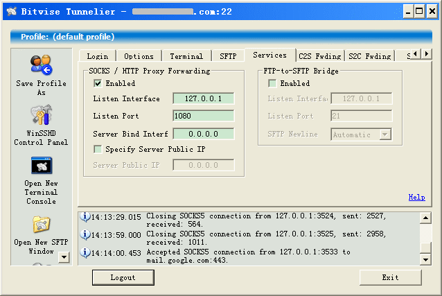

端口转发（Port forwarding），或称隧道技术（Tunneling），是指把原本不安全的TCP数据流通过SSH Secure Shell传输的方法。
<!-- more -->
动态端口转发（[Dynamic port forwarding](http://www.ssh.com/support/documentation/online/ssh/adminguide/32/Dynamic_Port_Forwarding.html)）所谓的动态，区别于本地端口转发和远程端口转发，说的是服务端口不定，且可能有多个，例如MSN、被动模式下的FTP。通过建立到SSH服务器的连接和配置好的动态端口转发，在本地提供一个SOCKS4/5代理，通过这个代理对目标服务器的访问即被自动转换为SSH服务器对目标服务器的访问。

常用软件有三，一是[MyEnTunnel](http://nemesis2.qx.net/pages/MyEnTunnel)，实际上MyEnTunnel是一个PuTTY Link的图形用户界面，并在此之上提供断线重连等级制，但由于不支持设置二级代理，在此略过；二是[SecureCRT](http://www.vandyke.com/products/securecrt/index.html)，它是最著名的商用SSH客户端软件，提供本地端口转发、远程端口转发、X11转发等众多功能，在此也略过。

以下主角登场，即[Tunnelier](http://www.bitvise.com/tunnelier)。Tunnelier对个人用户免费，功能适当，易于配置。

1. 下载安装；
2. 在Login页输入服务器地址，点击Proxy输入二级代理信息（如果你也需要），输入用户名，选择口令认证方式，输入口令，和选择保存口令；
3. 在Options页取消On Login的Open Terminal和Open SFTP；
4. 在Services页启用SOCKS/HTTP Proxy Forwarding；

配置Firefox的过程如下：

1. 在Add-ons搜索autoproxy扩展并安装；
2. 重启Firefox后在状态栏出现一个福字，右键点击它，选择Preferences，选择Proxy Rule->Add rule subscription，选择９ｆｗList (P.R.China)，点击Subscribe；
3. 选择Proxy Server->Edit proxy server，Add proxy，输入Tunnelier、127.0.0.1、1080，选择socks5，点击OK；
4. 选择Proxy Server->Choose proxy server，选择Tunnelier，点击OK；
5. 不要喝茶。

AutoProxy支持自动和全局两种工作模式，选择全局设置，一则在自动模式下未过滤地址只能使用直接连接而不能设置代理，二则免了代理对访问内容的记录和审查。
