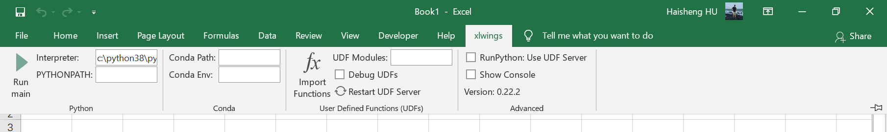

在MS官方推出Excel对Python语言支持之前，可以使用[xlwings](https://docs.xlwings.org/)方案。
<!-- more -->
如果你采用的发行是Anaconda或WinPython，恭喜你，你已经安装了xlwings。否则，使用`pip`手动安装：

```shell
pip install xlwings
xlwings addin install
```



顺利的话，你将在Excel顶端找到xlwings缎带区。在开始使用Python之前，需要对Excel进行一次性的设置。在File > Options > Trust Center > Trust Center Settings > Macro Settings下勾选Enable Trust access to the VBA project object model。

快速新建一个测试项目：

```shell
xlwings quickstart Book1
```

会新建一个Book1目录出来，Book1目录下有保存了宏的`Book1.xlsm`和同名Python文件`Book1.py`。

接下来见证奇迹。在xlwings缎带区点击Run main。
