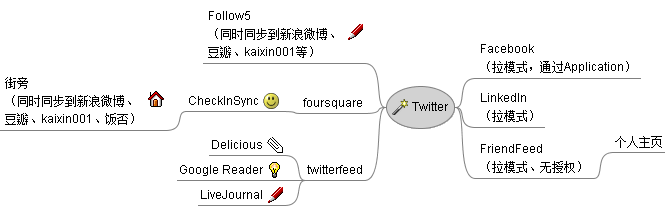

Facebook[不再支持](http://www.facebook.com/note.php?note_id=153496111346874)Wall imported stories，Myspace.cn旗下的9911从新年开始也ungelivable了，造成俺所使用的社会性软件同步关系跟[去年]()相比有了大幅调整。
<!-- more -->
最近用刚开放的[街旁API](http://code.google.com/p/jiepang-api/)写了个把街旁同步到foursquare的工具——[CheckInSync](http://checkinsync.appspot.com/)，已经加入进来，下面就上图了：

