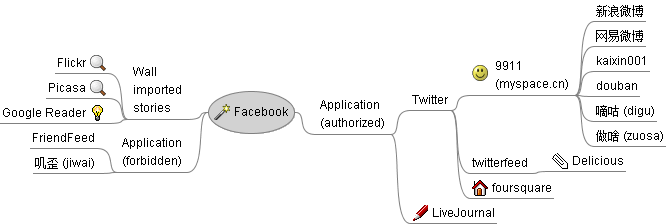

[twitterfeed](http://twitterfeed.com/)是利用定时轮询机制把RSS（RSS 2.0或Atom）同步到Twitter、Facebook等网站的网站。以下就说明一下把Delicious优雅的同步到Twitter的设置步骤。
<!-- more -->
所谓优雅是与Delicious自身提供的Settings->Sharing功能相比而说的，虽然Delicious原生功能的设置相当简便，且为准实时同步，但同步出来的字符串只是像 [http://icio.us/xxxxxx](http://icio.us/xxxxxx) 这样而已，对于Twitter读者不具有任何实际意义。因此在此还是选用twitterfeed，就算目前最快只是半小时轮询一次也没问题。

1. 登录twitterfeed，Create new feed；
2. 随意填入Feed Name，例如Delicious/hanson2010。在RSS Feed URL框填入 [http://feeds.delicious.com/v2/rss/YOUR\_NAME/tweetthis?count=15](http://feeds.delicious.com/v2/rss/YOUR_NAME/tweetthis?count=15) ，注意结尾处的tweetthis，这表示只读取具有tweetthis标签的书签，如果你希望同步全部书签，尽可去掉/tweetthis（你的RSS地址可以在Delicious首页下方得到）；
3. 打开Advanced Settings，在Update Frequency项选择每半小时和每次最多5个（或你希望的频率）；
4. 在Post Content项选择title only表示只获得书签的TITLE，选择title & description就表示同步出来的字符串形如TITLE: NOTES；
5. 推荐使用默认的[bit.ly](http://bit.ly/)作为URL缩短服务，点击bit.ly settings，输入API Login和API Key，可以在你的bit.ly Account页面找到；
6. 其他项目默认或留空，到第二步绑定你的Twitter帐号，和激活它；
7. 加个书签测试，别忘了加tweetthis标签，之后冲杯咖啡好了。

以下是我所使用的社会性软件之间的大致同步关系，如果没有这张图，也许会很容易产生涡流效应（虽然有些网站[明确声称](http://www.zuosa.com/Settings/settings.aspx?fun=4 "为避免造成信息死循环，做啥网不支持接力同步。即其他网站同步到做啥网的信息，不会再通过做啥网同步出去。")不支持接力同步）。

